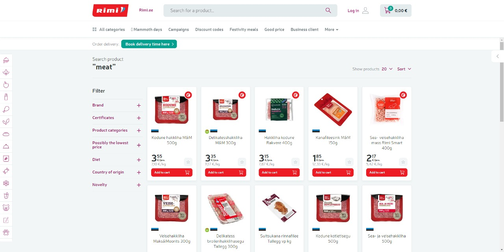
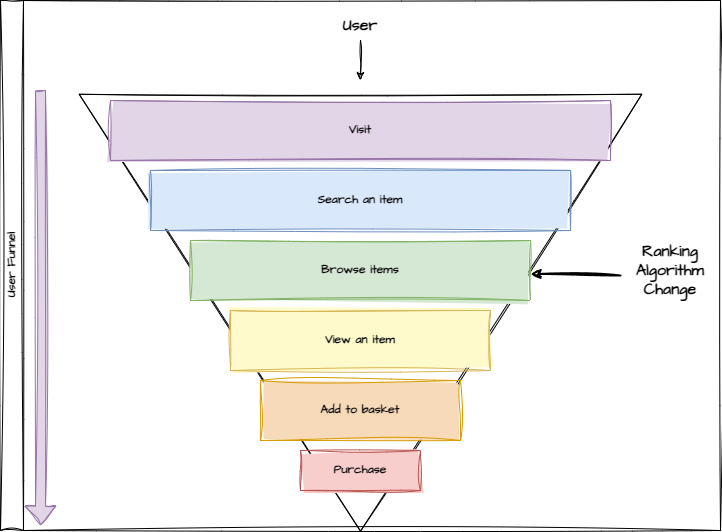
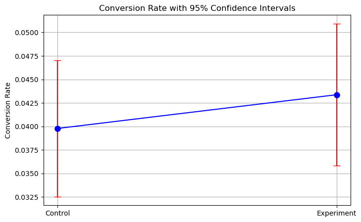
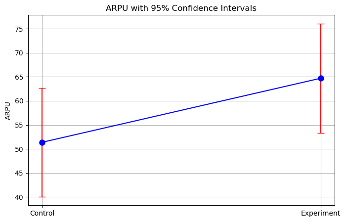
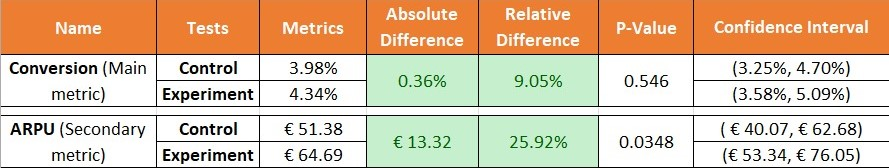

# Product Ranking Optimization | A/B Testing Project

## Project Overview
This project simulates an A/B testing scenario for an online grocery store, “Rimi,” to assess the impact of a new product ranking algorithm on user behavior.

## Methodology
1. **Problem statement** - What is the goal of the experiment?
    - Understanding the nature of the product
    - Asking clarifying questions:
        - What is the user journey?
        - What is the success metric? It should be:
            - Measurable
            - Attributable
            - Sensitive
            - Timely
2. **Hypothesis testing** - What result do you hypothesize from the experiment?
    - Set up: 
        - Null hypothesis 
        - Alternative hypothesis 
        - Significance level
        - Statistical power
        - Minimum detectable effect (MDE)
3. **Design the Experiment** - What are your experiment parameters?
    - Determine:
        - Randomization unit
        - Target population in the experiment
        - Sample size
        - Duration of the experiment
4. **Data Generation** - What are the requirements for running an experiment?
    - Determine: 
        - Key columns
        - Probability distributions 
    - Write code to generate data
5. **Validity Checks** - Did the experiment run soundly without errors or bias?
    - Check for:
        - Instrumentation Effect
        - External Factors
        - Selection Bias
        - Sample Ratio Mismatch
        - Novelty Effect
6. **A/B Testing** - Is the observed change in the metric both statistically and practically significant?
    - Run statistical tests
    - Assess the observed lift:
        - P-value
        - Confidence intervals
7. **Launch Decision** - Based on the results and trade-offs, should the change be launched?
    - Consider:
        - Metric Trade-Offs
        - Cost of Launching

## Step 1 - Problem statement

### Understanding the Nature of the Product
Rimi is an online grocery store that offers a wide range of products, including fresh produce, meat, dairy, baked goods, and more. The store uses a product ranking system or recommendation algorithm.

When a user enters keywords such as "meat" or "fruits," this algorithm generates a list of products that could be relevant to that customer, based on factors like their profile, purchase history, and other data.

If we modify this ranking algorithm, the suggested products may become more relevant to customers, which in turn should **boost sales** for the online store.

### User Journey

### Success Metrics
To define the success metric, we need to consider the folowing guiding princeples, the metric should be:
- Measurable
- Attributable
- Sensitive
- Timely

Our success metric is **Conversion Rate**, which we aim to increase. However, it's crucial that this improvement does not come at the expense of the **Average Revenue Per User (ARPU)**, which should remain stable or improve.

## Step 2 - Hypothesis testing
**Conversion Rate Hypotheses**:
- Null Hypothesis (H0): The сonversion rate between the old and new ranking algorithms is the same.
- Alternative Hypothesis (Ha): The conversion rate between the old and new ranking algorithms is different.

**ARPU Hypotheses**:
- Null Hypothesis (H0): The ARPU between the old and new ranking algorithms is the same.
- Alternative Hypothesis (Ha): The ARPU between the old and new ranking algorithms is different.

1. **Alpha** = 0.05

2. **Statistical Power** = 0.8 

3. **MDE** = 0.3% 
    - 0.3% MDE: This is a good balance, it’s sensitive enough to detect meaningful changes in revenue, while also being realistic in terms of sample size and experiment duration.

## Step 3 - Design the Experiment

1. **Randomization Unit**: User

2. **Target Population in the Experiment**: Users = Visitors who searches a product

3. **Duration of the Experiment**: 1 to 2 weeks
    - *"Typical duration of the experiment is 1 to 2 weeks. You don’t want to run the experiment for less than one week, because you want to account for the day of the week effect, meaning there could be some underlying difference in terms of how the user engages with the website during the weekdays versus the weekends" (Daniel Lee, 2022).*

### Determine the Sample Size

We used Python, specifically the `statsmodels` library, and the `NormalIndPower().solve_power()` method to estimate the sample size. This method is based on the following formula for sample size estimation:

$$n = \left( \frac{Z_{\alpha/2} + Z_\beta}{\frac{\delta}{\sqrt{p(1-p)}}} \right) ^ 2 $$

Where:
- $n$ — This is the required sample size for each group (control and experimental).
- $Z_{\alpha/2}$ — This is the critical value of the normal distribution for the significance level ($\alpha$). It is set as $\alpha/2$ because we often use a two-tailed test. For example, for a significance level of 0.05, the value of $Z_{\alpha/2}$ is approximately 1.96.
- $Z_\beta$ — This is the critical value for the test power ($\beta$). For example, for a power of 0.8, the value of $Z_\beta$  is approximately 0.84.
- $p$ — This is the current base conversion rate (e.g. 4%).
- $\delta$ —  This is the minimum detectable effect (MDE). It is the difference between the means of the control and experimental groups that you want to detect. The smaller $\delta$, the larger the sample size needed to accurately detect this difference.

#### Assumptions
Since we don't have any real metrics data, we'll estimate what they might look like based on industry averages.

##### Estimating Conversion Rate
1. Typical industry data:
    - Based on ChatGPT’s response, on average, the conversion rate for online grocery stores can range from 2% to 5%. However, grocery stores have a certain specificity — if a customer visits with the intent to buy groceries, the conversion rate might be higher compared to apparel or electronics stores.
    - For large retailers like Rimi, the conversion rate may be closer to the upper end of this range.
2. Assumption:
    - **Conversion rate** = 4% (which corresponds to the conversion rate for a typical online grocery store).

##### Estimating ARPU
1. Typical industry data:
    - ChatGPT suggests that ARPU for online grocery retailers often ranges from 20 to 100 euros, depending on the region and shopping frequency. The standard deviation, on average, can range from 20% to 50% of the average ARPU.
2. Assumption:
    - **Average ARPU** = 50 euros

#### Exact sample size
According to calculations, each group should have **2790** participants.

## Step 4 - Data Generation

### Dataset Description
Since we do not have access to real-world data, we have generated a **synthetic dataset** that simulates user behavior based on realistic assumptions and probability distributions. This dataset allows us to mimic an online grocery store scenario for testing purposes.

The script used to generate this dataset can be found in the `data_generation.ipynb file`, available [here](https://github.com/S0la1re/Product-Ranking-AB-Testing/blob/Development/data_generation.ipynb).

### Key Columns
- **user_id**: A unique identifier for each user.
- **group**: Either 'control' or 'experiment', indicating whether the user belongs to the control group or the experiment group.
- **session_date**: The date and time of the user's session.
- **product_views**: The number of products viewed by the user during the session.
- **cart_adds**: The number of items added to the cart.
- **purchase_amount**: The total amount spent by the user in the session (if any purchase was made).
- **session_duration**: The duration of the session in minutes.
- **device_type**: The type of device used by the user (mobile, desktop, or tablet).
- **traffic_source**: The source of traffic that brought the user to the site (organic, paid ad, or direct).
- **region**: The region where the user is located (Estonia, Latvia, Lithuania).
- **visitor_type**: Whether the user is a "new" or "old" visitor (new or returning customer).

### Variables and Distributions
1. **Session Date**:
    - **Distribution**: Randomly assigned from a uniform distribution over a specific date range with an hourly frequency.
    - **Assumption**: User sessions are evenly distributed throughout the experiment period without any special temporal effects.
2. **Product Views & Cart Adds**:
    - **Distribution**: Both follow **Poisson distributions**.
        - `product_views`: $\lambda$ = 5.
        - `cart_adds`: $\lambda$ = 2
    - **Assumption**: The number of products viewed and items added to the cart by users occurs randomly but follows a discrete count distribution typical for e-commerce behavior.
3. **Session Duration**:
    - **Distribution**: **Exponential distribution** with a scale parameter of 10 (minutes).
    - **Assumption**: Most sessions are short, with a few longer sessions, mimicking user behavior in online shopping where session duration has a long tail.
4. **Device Type**:
    - **Distribution**: Categorical with probabilities:
        - Mobile: 70%
        - Desktop: 25%
        - Tablet: 5%
    - **Assumption**: Most users access the site via mobile, reflecting common device usage patterns in online retail.
5. **Traffic Source**:
    - **Distribution**: Categorical with probabilities:
        - Organic: 50%
        - Paid Ad: 30%
        - Direct: 20%
    - **Assumption**: A majority of users come from organic search, followed by paid ads and direct traffic.
6. **Region**:
    - **Distribution**: Categorical with probabilities:
        - Estonia: 30%
        - Latvia: 40%
        - Lithuania: 30%
    - **Assumption**: User distribution is balanced across three Baltic countries based on approximate population sizes.
7. **Visitor Type**:
    - **Distribution**: Categorical with probabilities:
        - New visitors: 30%
        - Returning visitors: 70%
    - **Assumption**: Returning visitors constitute the majority of the traffic, typical for e-commerce platforms.
8. **Purchase Amount**:
    - **Distribution**: Mixed distribution combining:
        - **Exponential distribution** for smaller purchases (scale = ARPU/3).
        - **Log-normal distribution** for larger purchases (mean = log(ARPU), sigma = 0.5).
        - Users have a 70% probability of making smaller purchases and a 30% probability of larger ones.
    - **Assumption**: Most users make small purchases, but a significant minority makes larger purchases. The distribution is driven by ARPU (Average Revenue Per User) and conversion rate, which are specified for both control and experiment groups.

## Step 5 - Validity Checks

Before conducting any statistical tests, it is essential to perform validity checks to ensure that the experiment results are reliable.

### Summary
- **Instrumentation Effect**: No issues were detected as the synthetic dataset was thoroughly validated.
- **External Factors**: Not applicable to our synthetic data, ensuring no impact from outside influences such as economic conditions or holidays.
- **Selection Bias**: Both control and experiment groups were found to be homogeneous, with no significant differences in key metrics before the experiment began. A/A test results:
    - product_views: p-value = 0.7843, Mann-Whitney U test
    - cart_adds: p-value = 0.8353, Mann-Whitney U test
    - purchase_amount: p-value = 0.4702, Mann-Whitney U test
    - session_duration: p-value = 0.9470, Mann-Whitney U test
- **Sample Ratio Mismatch**: The Chi-Square test confirmed a perfect 50/50 split between the control and experiment groups, eliminating any concerns about unequal sample sizes. Chi-Square test results:
    - Chi-Square Statistic: 0.0000, p-value: 1.0000
- **Novelty Effect**: There were no significant differences in behavior between new and returning visitors, indicating that the observed results are not due to temporary engagement spikes. A/A test results:
    - product_views: p-value = 0.0773, Mann-Whitney U test
    - cart_adds: p-value = 0.3787, Mann-Whitney U test
    - purchase_amount: p-value = 0.1764, Mann-Whitney U test
    - session_duration: p-value = 0.6082, Mann-Whitney U test

Overall, the experiment data has passed all validity checks, confirming its suitability for further statistical analysis and interpretation.

## Step 6 - Interpret Results

### Visualizations 

#### Conversion

#### ARPU

### Summary

### Interpretation
We observed some improvement in the conversion rate for the experiment group compared to the control group, with an absolute increase of 0.36%, which is greater than the Minimum Detectable Effect (MDE) of 0.3%. However, there is **not enough evidence** at the 5% significance level to conclude that the conversion rate between the old and new ranking algorithms is different (p-value = 0.546). This result is likely due to high variability in our groups.

For ARPU, we observed an absolute increase of €13.32, which is statistically significant (p-value = 0.0348). This 25.92% uplift indicates that users exposed to the new ranking algorithm are spending significantly more per session than those in the control group.

## Step 7 - Launch Decision

### Decision
If this were a real case, the best course of action would be to **rerun the experiment with increased statistical power** to ensure that the observed change is practically significant.

In addition, it would be beneficial to **analyze potential factors contributing to conversion variability**. Identifying and mitigating these factors could improve the accuracy of the test and reduce errors in subsequent iterations of the experiment.

## References
1. Daniel Lee. (2022, February 25). *A/B Testing in Data Science Interviews by a Google Data Scientist | DataInterview*. YouTube. [https://www.youtube.com/watch?v=DUNk4GPZ9bw&t=207s&ab_channel=DataInterview](https://www.youtube.com/watch?v=DUNk4GPZ9bw&t=207s&ab_channel=DataInterview)