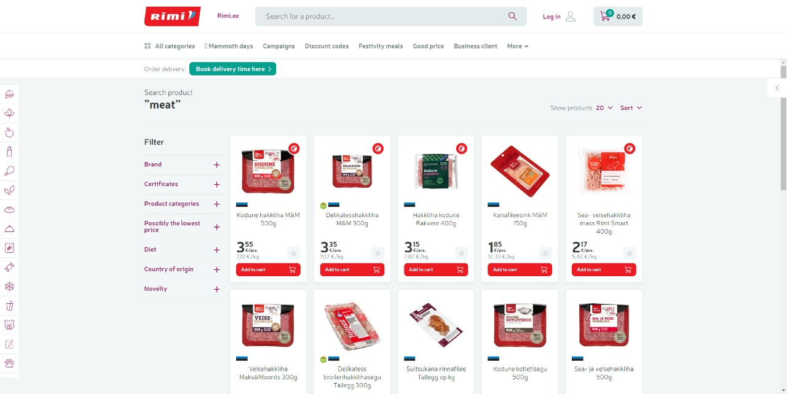
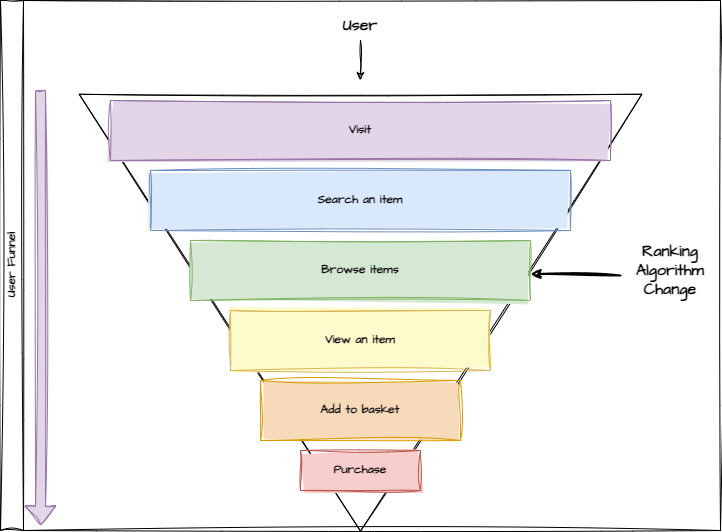
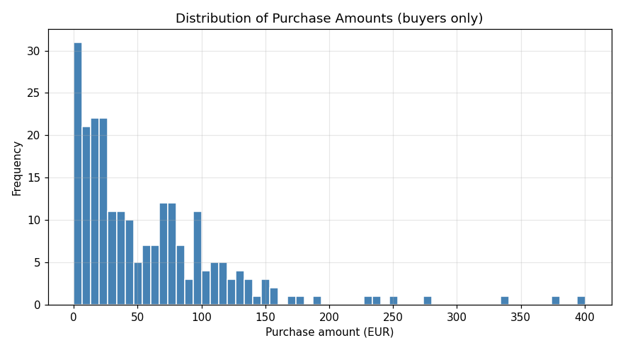
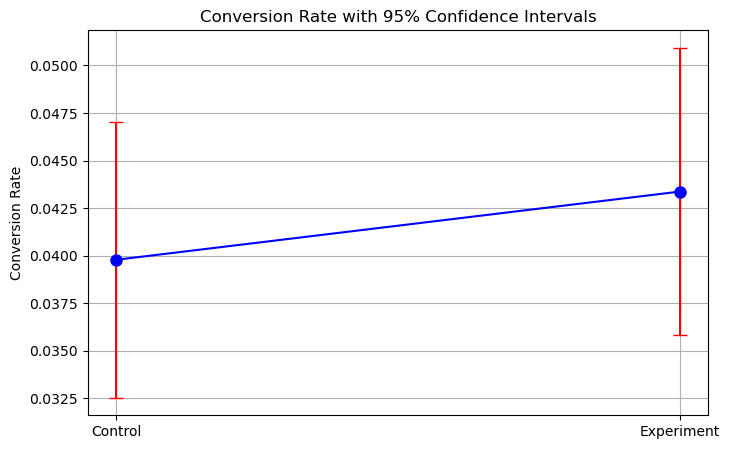
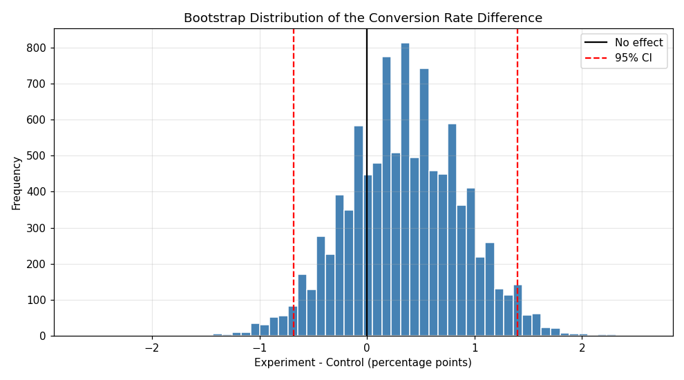
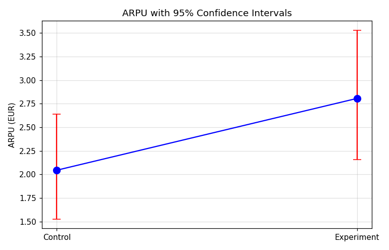
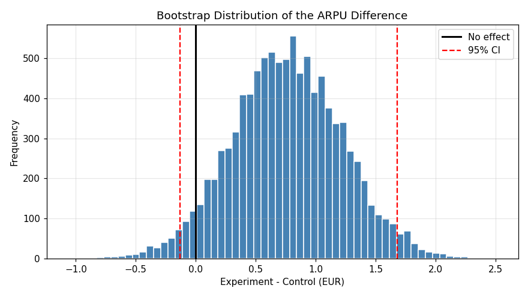

# Product Ranking Optimization | A/B Testing Project

Designing, running and interpreting an A/B test end to end — including the parts I got wrong
the first time.

> **This is a simulation built for practice.** The dataset is synthetic and I generated it
> myself. Rimi is used purely as a realistic setting and has no involvement in this project.
> No number here describes real user behaviour or a real business outcome. What this project
> demonstrates is the *process*: how you decide what to measure, how many users you need,
> whether the experiment ran cleanly, and whether the result justifies shipping.
>
> **Revised in 2026.** The original version contained two real errors — a sample size
> calculation that was wrong by a factor of 24, and a bootstrap I applied incorrectly. Both are
> documented in place rather than quietly deleted, along with what they broke and how they were
> fixed. Correcting them reversed the project's conclusion.

**Written for a mixed audience.** Sections marked *In plain terms* explain the reasoning
without statistics vocabulary. Everything else assumes some familiarity.

---

## Table of Contents

1. [What happened, in short](#what-happened-in-short)
2. [Why A/B testing at all](#why-ab-testing-at-all)
3. [Methodology](#methodology)
4. [Step 1 — Problem statement](#step-1--problem-statement)
5. [Step 2 — Hypotheses](#step-2--hypotheses)
6. [Step 3 — Design the experiment](#step-3--design-the-experiment)
7. [Step 4 — Data generation](#step-4--data-generation)
8. [Step 5 — Validity checks](#step-5--validity-checks)
9. [Step 6 — A/B testing](#step-6--ab-testing)
10. [Step 7 — Launch decision](#step-7--launch-decision)
11. [What I got wrong](#what-i-got-wrong)
12. [What I would do differently](#what-i-would-do-differently)
13. [Repository and how to run it](#repository-and-how-to-run-it)
14. [References](#references)

---

## What happened, in short

An online grocery store wants to change the algorithm that ranks products in search results.
Better ranking should mean more relevant suggestions, which should mean more purchases. Does it?

| Metric | Control | Experiment | Difference | p-value | 95% CI of the difference |
|---|---|---|---|---|---|
| **Conversion rate** (primary) | 3.98% | 4.34% | +0.36pp | 0.55 | [-0.68pp, +1.40pp] |
| **ARPU** (guardrail) | €2.04 | €2.81 | +€0.76 | 0.097 | [-€0.13, +€1.68] |

**Decision: do not launch.** Both metrics moved in the desired direction, and neither movement
can be distinguished from noise.

> **In plain terms:** the numbers look encouraging but are not trustworthy, because of a mistake
> I made before the experiment started. I ran it with 2,790 users per group when it needed around
> 65,000 — too few to detect an effect this size even if one existed. Shipping on this evidence
> would be guessing and calling it data.

---

## Why A/B testing at all

If you change something on a website and sales go up next week, you have learned almost nothing.
Sales also move with the weather, payday, holidays, competitors' promotions, and pure chance.

An A/B test splits users randomly into two groups at the same time: one sees the old version,
one the new. Both groups get the same weather and the same payday, so whatever differs between
them is attributable to the change.

The catch is that random splitting also produces random *differences* — flip two fair coins 100
times each and you will not get 50/50 twice. So the question is never "did the number go up",
but "did it go up by more than chance would produce anyway".

---

## Methodology

The project follows a seven-step framework taught by Daniel Lee, a data scientist at Google
(see [References](#references)), applied to a scenario of my own construction.

1. **Problem statement** — what is the goal, and what does success look like?
2. **Hypotheses** — what result do we expect, and what evidence would change our mind?
3. **Design** — who is in the experiment, how many of them, and for how long?
4. **Data generation** — building the dataset (in a real project: instrumenting and collecting it)
5. **Validity checks** — did the experiment run cleanly, before we look at the result?
6. **A/B testing** — is the observed change real, and is it big enough to matter?
7. **Launch decision** — given the result and its trade-offs, do we ship?

> **In plain terms:** the order matters more than any individual step. Every decision that could
> bias the outcome — which metric counts, what size of effect matters, how many users are needed
> — is made *before* seeing the data.

---

## Step 1 — Problem statement

### The product

Rimi is an online grocery store. When a customer searches for something like "meat" or "fruits",
a ranking algorithm decides which products appear and in what order, based on their profile,
purchase history and other signals.

If the ranking gets better, suggestions should be more relevant, and more customers should buy.


*The surface being changed: the ranked list a customer sees after searching.*

### The user journey


*The ranking change acts at a single point in the funnel — everything below it is downstream.*

Mapping the funnel first constrains which metrics can possibly respond.

> **In plain terms:** if the change only affects what happens after someone searches, then
> "total site visits" cannot be the success metric — the change has no way to reach it. Picking
> a metric the change cannot move is a common way to run an experiment that was never going to
> show anything.

### Success metrics

A good metric should be **measurable**, **attributable** to the change, **sensitive** enough to
move within the experiment window, and **timely** rather than arriving months later.

- **Primary metric: conversion rate** — the share of users who make a purchase. We want it up.
- **Guardrail metric: ARPU** (average revenue per user) — should stay flat or improve.

> **In plain terms:** almost any single metric can be improved in a way that hurts the business.
> Push cheap items to the top of every search and more people buy something, so conversion rises
> while revenue per customer falls. The guardrail catches that kind of hollow win. It does not
> need to improve — it needs to not get worse.

---

## Step 2 — Hypotheses

**Conversion rate**
- H₀: the conversion rate is the same for both algorithms.
- Hₐ: the conversion rates differ.

**ARPU**
- H₀: ARPU is the same for both algorithms.
- Hₐ: ARPU differs.

**Parameters, all fixed before running:**

| Parameter | Value | What it means |
|---|---|---|
| Significance level (α) | 0.05 | Accepted risk of calling a difference real when it is not |
| Statistical power | 0.80 | Probability of detecting a real effect if one exists |
| Minimum detectable effect | 0.3pp | The smallest change we care about at all |

> **In plain terms:** the null hypothesis is the boring assumption that nothing changed. The
> burden of proof is on the new algorithm to overturn it — the same logic as presumption of
> innocence. Two kinds of mistake are possible: believing in an effect that is not there
> (5% risk here) and missing one that is (20% risk here). You cannot drive both to zero; you
> choose how to split the risk, and you choose *before* looking.
>
> The MDE is the honest question "how small a change would still be worth building and
> maintaining?" Set it tiny and you need an enormous number of users; set it large and you miss
> modest but real improvements. It is a business decision wearing a statistical costume — and the
> place where I made my main mistake.

Both tests are two-tailed: we are checking whether the metric *changed*, not merely whether it
improved. A new algorithm can make things worse, and the test should be able to say so.

---

## Step 3 — Design the experiment

| Decision | Value |
|---|---|
| Randomisation unit | User |
| Target population | Visitors who search for a product |
| Duration | 1–2 weeks |

**Randomising by user, not by session,** means a person sees the same version every time they
return. Per-session assignment would show the same shopper different rankings on different
visits — confusing for them, and it contaminates the comparison.

**Only users who search** are included, because only they are exposed to the change. Everyone
else would dilute the effect with people who could not have been affected.

**One to two weeks** covers a full weekly cycle. Shopping on Tuesday differs from Saturday, and
an experiment running only on weekdays measures weekday shoppers.

These three choices decide who is actually being compared. Get them wrong and no amount of
careful statistics afterwards will save the result.

### Sample size

Sample size was estimated with `statsmodels`, using `NormalIndPower().solve_power()`:

$$n = \left( \frac{Z_{\alpha/2} + Z_\beta}{\frac{\delta}{\sqrt{p(1-p)}}} \right)^2$$

Where $n$ is the required size per group, $Z_{\alpha/2}$ and $Z_\beta$ come from the
significance level and power, $p$ is the baseline conversion rate, and $\delta$ is the MDE.

> **In plain terms:** the formula answers "how many people do I need before a difference this
> small stops being drowned out by chance?" The relationship is brutal — halving the effect you
> want to detect roughly quadruples the users required.

**Assumptions used:** baseline conversion 4%, ARPU €50. These are illustrative values chosen to
make the simulation plausible, not measurements. In a real experiment they would come from the
product's own history — the only source that makes a power calculation meaningful. Guessing the
baseline means guessing the sample size.

**Result: 2,790 participants per group.**

> **UPDATE (2026 Correction) — this is wrong.**
>
> The correct requirement is **65,000–70,000 per group**, roughly 24 times larger. Verify it for
> the parameters above with
> [Evan Miller's sample size calculator](https://www.evanmiller.org/ab-testing/sample-size.html).
>
> **In plain terms:** separating 4.0% from 4.3% is a very small target. At 2,790 users per group
> that is roughly 111 buyers against 121, and a gap of ten purchases is exactly what chance
> produces on its own. Detecting it reliably takes tens of thousands per group.
>
> Read everything below in that light: the experiment was too small to answer its own question.
> This is the project's most consequential error, and it happened before a single line of
> analysis was written.

---

## Step 4 — Data generation

No real data was available, so a synthetic dataset was generated to simulate user sessions.
The generator is a single parameterised function in `data_generation.ipynb`.

> **In plain terms:** in a real project this step is instrumentation — making sure the events you
> need are logged, correctly, for every user. Here it is replaced by code that produces plausible
> fake behaviour. The discipline is the same: decide what each variable should look like, and
> why, before generating or collecting anything.

### Columns

`user_id`, `group`, `session_date`, `product_views`, `cart_adds`, `purchase_amount`,
`session_duration`, `device_type`, `traffic_source`, `region`, `visitor_type`

### Distributions and the reasoning behind them

| Variable | Distribution | Why |
|---|---|---|
| `product_views` | Poisson, λ = 5 | Counts of events in a session — the standard shape for "how many times did something happen" |
| `cart_adds` | Poisson, λ = 2 | Same logic, lower rate: people add fewer items than they view |
| `session_duration` | Exponential, scale = 10 min | Most sessions are short, a few run long — a long right tail |
| `purchase_amount` | 70% Exponential (scale = ARPU/3), 30% Log-normal (mean = log(ARPU), σ = 0.5), zeroed for non-buyers | Most baskets are small, a minority are large. A single distribution cannot produce both |
| `session_date` | Uniform across the window, hourly | No deliberate time-of-day or day-of-week pattern |
| `device_type` | mobile 70%, desktop 25%, tablet 5% | Mobile-dominant, typical of retail |
| `traffic_source` | organic 50%, paid 30%, direct 20% | Search-led acquisition |
| `region` | Estonia 30%, Latvia 40%, Lithuania 30% | Roughly proportional to Baltic populations |
| `visitor_type` | returning 70%, new 30% | Grocery is a repeat-purchase category |


*Purchase amounts among buyers. The long right tail is why revenue fails a normality check and
why the mean is a fragile summary of it — both facts matter later, in [Step 6](#step-6--ab-testing).*

**Generation parameters:** control conversion 4.1% versus experiment 4.6%, giving a planted
effect of **0.5pp**.

> **In plain terms:** because I chose the effect myself, finding it would prove nothing about
> ranking algorithms. What it allows is a real test of the *method* — I know the right answer in
> advance, so I can check whether the analysis recovers it. It did not, which turned out to be
> the most useful thing this project produced.

**Known weakness:** no random seed is set in the generator, so re-running it produces a
different dataset. Only the committed CSV is stable. This should be fixed.

---

## Step 5 — Validity checks

> **In plain terms:** before asking "did it work", ask "did the experiment run properly at all".
> If assignment was broken or tracking failed on some devices, the result is noise no matter how
> good the statistics are. Checking afterwards is too late — by then you already know which
> answer you would prefer.

### The checks

| Check | What it catches | Method | Result |
|---|---|---|---|
| **Sample Ratio Mismatch** | Broken assignment | Chi-Square goodness of fit¹ | statistic 0.0000, p = 1.0000 — an exact 50/50 split |
| **Selection bias** | Groups that differed before the change | A/A test¹, control vs experiment, on 4 metrics | product views 0.7843, cart adds 0.8353, purchase amount 0.4702, session duration 0.9470 |
| **Novelty effect** | Reaction to novelty rather than to the change | Same 4 metrics¹, new vs returning visitors | product views 0.0773, cart adds 0.3787, purchase amount 0.1764, session duration 0.6082 |
| **Instrumentation effect** | Broken or double-counted tracking | Dataset validation | No issues |
| **External factors** | Holidays, outages, promotions | N/A for synthetic data | Not applicable |

¹ Which test is used in each case is decided by a fixed rule, described below.

**Sample Ratio Mismatch.** A 50/50 split that arrives as 48/52 means something in the assignment
system is leaking — and whatever drops those users is probably not random, which contaminates
the comparison.

**Selection bias**, checked with an **A/A test** on four metrics: `product_views`, `cart_adds`,
`purchase_amount` and `session_duration`.

> **In plain terms — what an A/A test is.** Run the same comparison you plan to run later, but
> on something the change could not possibly have affected — hence A/A rather than A/B.
>
> If two supposedly identical groups differ anyway, you have not learned something about your
> product; you have learned that your groups were never identical, and every result that follows
> is suspect. A passing A/A test is evidence the randomisation worked — and it catches broken
> pipelines, like tracking that silently fails on one browser, before they get mistaken for an
> effect.

> **A weakness worth naming.** `purchase_amount` does not belong in this check: it is the
> outcome the experiment is testing. A difference there would mean the treatment worked, not
> that randomisation failed. The other three are fine here, having been generated with identical
> parameters for both groups.
>
> In a real experiment the safe choices are attributes fixed *before* exposure — device, region,
> visitor type — or behaviour from a pre-experiment period.

#### How the statistical test is chosen

Every comparison here and in Step 6 — including the one above — uses the same helper, which
checks the assumptions before selecting a test:

1. **Normality** — Shapiro-Wilk for smaller samples, Anderson-Darling above 5,000
2. **Equal variance** — Levene's test
3. **Selection** — Student's t-test if normal with equal variance, Welch's t-test if normal with
   unequal variance, Mann-Whitney U otherwise

> **In plain terms:** using a test whose assumptions your data violate produces confident
> nonsense. Revenue is heavily skewed — most people spend nothing, a few spend a lot — so it
> fails the normality check and falls through to the non-parametric option. That is why
> Mann-Whitney U appears throughout.
>
> What matters most is *when* the rule is fixed: before any result is visible, which removes the
> temptation to try several tests and keep the nicest p-value.

**Novelty effect.** People sometimes engage with a new interface simply because it is new, then
drift back to old habits. An effect that fades after a week is not a real improvement — it is a
reaction to change itself.

The check compares new against returning visitors on the same four metrics.

> **A second weakness worth naming.** As implemented this pools both groups and compares new
> against returning visitors overall, which measures whether those two populations differ in
> general — not whether the treatment effect is driven by novelty.
>
> Better: measure the effect day by day and see whether it decays, or compare the effect among
> new users against the effect among returning users. Only returning users can experience
> novelty, because only they saw the old version. Worth redoing properly.

**All checks passed**, so the experiment itself ran cleanly. That is a separate question from
whether it was large enough to answer anything — it was not.

---

## Step 6 — A/B testing

### Conversion rate

| Group | Rate | Buyers | 95% CI |
|---|---|---|---|
| Control | 3.98% | 111 / 2,790 | [3.25%, 4.70%] |
| Experiment | 4.34% | 121 / 2,790 | [3.58%, 5.09%] |

Chi-Square test: statistic 0.3643, **p = 0.5461**. We cannot reject H₀.


*The intervals overlap heavily, which is the visual form of "we cannot tell these apart".*

> **In plain terms:** ten purchases apart, out of 5,580 people. A p-value of 0.55 means that if
> the algorithms were identical, you would see a gap this large or larger about 55% of the time
> from luck alone.

#### Bootstrapped check on conversion

Bootstrapping asks how much an estimate would wobble if you could collect the data again. You
cannot, so you simulate it: repeatedly draw a new sample of the same size *from your own data,
with replacement*, and recompute the answer each time. The spread of those answers estimates the
uncertainty. It assumes nothing about the shape of the data, which makes it well suited to
revenue.

> **UPDATE (2026 Correction) — the original bootstrap here was wrong.**
>
> The original code drew 1,000 resamples from each group, collapsed each one to a single group
> mean, and then fed those two arrays of 1,000 means into the significance test as though they
> were raw observations. The confidence interval then divided the bootstrap standard deviation
> by √1000 a second time.
>
> **In plain terms:** averages vary much less than individual people do. Individual customers
> spend wildly different amounts; the *average* of 2,790 customers barely moves between
> resamples. By treating those averages as if they were individual observations, I told the test
> the data were vastly more consistent than they are. Doing it twice compounded the error.
>
> **The lesson:** bootstrapping cannot create precision that is not in the data. If a result
> becomes dramatically more certain after resampling, the procedure is broken, not the data.
>
> Original figures: p = 5.98e-81 — small enough to have been an immediate red flag — with
> control CI [3.95%, 4.00%] and experiment CI [4.31%, 4.36%], just 0.05pp wide.

Done correctly, you bootstrap the **difference** between the groups — never each group
separately — and read the 2.5th and 97.5th percentiles of that distribution as the interval:

Observed difference: **+0.36pp**<br>
95% CI: **[-0.68pp, +1.40pp]**<br>
Bootstrap p-value: **0.53**


*Ten thousand simulated versions of the experiment. The black line marks "no effect", and it
sits well inside the bulk of the distribution — a result like ours is ordinary even when the
algorithms are identical.*

The interval comfortably contains zero, and the bootstrap p-value of 0.53 agrees with the
Chi-Square result of 0.55.

> **In plain terms:** two methods on the same data should land in roughly the same place. They do
> now. The earlier version disagreed by eighty orders of magnitude — the clue that the method was
> broken, not that the data were remarkable.

### ARPU

> **UPDATE (2026 Correction) — the original analysis was wrong twice over.**
>
> It filtered the data to `purchase_amount > 0` before comparing, then labelled the result ARPU.
>
> **The metric was misnamed.** Average revenue among buyers only is ARPPU (average revenue per
> *paying* user). ARPU divides total revenue by *all* users, non-buyers included.
>
> **The filter also broke the comparison.** Conversion is affected by the treatment, so
> filtering on it means selecting on something the algorithm influences.
>
> **In plain terms:** the whole value of random assignment is that the two groups are otherwise
> identical. Keep only the buyers and that guarantee evaporates, because *who becomes a buyer*
> is exactly what the algorithm changes. If better ranking converts hesitant shoppers who
> previously left empty-handed, the experiment group's buyers now include people the control
> group's do not. The average basket shifts because the crowd changed, not because anyone's
> behaviour did — and no choice of statistical test repairs that.
>
> **The rule:** you may split by things known *before* the experiment — region, device, new
> versus returning. You may not split by things that happened *after* and depend on the change.
>
> Original figures: p = 0.0349, control €51.38, experiment €64.69 — the only apparently
> significant result in the entire experiment, and an artefact of this filter.

ARPU across all users, zeros included:

| Group | ARPU | Users |
|---|---|---|
| Control | €2.04 | 2,790 |
| Experiment | €2.81 | 2,790 |

Difference: **+€0.76 (+37.3%)**<br>
Welch's t-test: **p = 0.097**<br>
Bootstrap 95% CI of the difference: **[-€0.13, +€1.68]**


*ARPU by group, with bootstrapped intervals. Note the vertical scale: the intervals are wide
relative to the gap between the groups.*


*The same simulation applied to revenue. The distribution leans positive, but a meaningful slice
of it still sits left of zero — which is what "not significant" looks like when you draw it.*

Both methods agree: **not statistically significant**, and the interval includes zero.

For reference, revenue among buyers only (ARPPU) was €51.38 against €64.69 — a diagnostic worth
carrying into a future hypothesis, not evidence of an effect.

### Summary

| Metric | Control | Experiment | Difference | Test | p-value | 95% CI of the difference |
|---|---|---|---|---|---|---|
| Conversion rate (primary) | 3.98% | 4.34% | +0.36pp | Chi-Square | 0.546 | — |
| Conversion rate (bootstrap) | 3.98% | 4.34% | +0.36pp | Bootstrap of the difference | 0.53 | [-0.68pp, +1.40pp] |
| ARPU (guardrail) | €2.04 | €2.81 | +€0.76 | Welch's t-test | 0.097 | [-€0.13, +€1.68] |

Conversion moved by +0.36pp, which exceeds the 0.3pp MDE — but not significantly, and the
Chi-Square test and the corrected bootstrap agree on that. ARPU is likewise not significant.
Both metrics point the right way; neither can be distinguished from noise.

---

## Step 7 — Launch decision

### Decision: do not launch

**Reasoning**

1. **Neither metric is significant.** Not the primary one, and not the guardrail once it is
   measured correctly.
2. **The experiment was underpowered by roughly 24x.** With 2,790 users per group instead of
   65,000–70,000, an effect of the size observed would very likely have been missed. Failing to
   detect an effect here is *not* evidence that no effect exists — the design could not have
   told the difference.
3. **Shipping on a directionally pleasing but non-significant result** is how organisations
   accumulate changes that quietly do nothing while everyone believes the product is improving.

> **In plain terms:** both numbers went up, and it would be easy to write "promising results,
> recommend launch" and move on. But "the number went up" and "the change caused the number to go
> up" are different claims, and only the second justifies shipping. The honest answer is not yes
> or no — it is *we do not know, and the reason is that I designed the experiment too small.*

**"Not significant" does not mean "no effect".** The interval for conversion runs from -0.68pp
to +1.40pp, compatible with a meaningful decline, with nothing, and with a solid improvement. A
narrow interval around zero would be evidence of no effect; a wide one like this is evidence the
experiment was too small to say anything.

A 0.5pp effect **was** in fact planted in the data and the analysis failed to detect it — a
textbook false negative, demonstrated on live numbers rather than in the abstract.

**Next steps**

1. Recalculate the required sample size for a 0.3pp MDE at 80% power, and validate it against an
   independent calculator before committing.
2. Re-run at that sample size. At realistic traffic this takes considerably longer than the
   original 1–2 week window; plan the duration around the requirement rather than the reverse.
3. Measure ARPU across all users, not among buyers.
4. Reconsider whether conversion rate is the most sensitive available primary metric, given how
   hard a 0.3pp MDE on a 4% baseline drives the sample size.

---

## What I got wrong

Kept visible on purpose. Both errors are documented in place above.

**1. The sample size, wrong by a factor of 24.** The most consequential, because it happened
before any analysis and invalidated everything downstream. ([Step 3](#sample-size))

**2. The bootstrap.** I resampled each group separately, reduced each resample to a mean, then
treated those means as raw data — inflating certainty to p = 5.98e-81.
([Step 6](#bootstrapped-check-on-conversion))

**3. ARPU measured among buyers only.** A naming error and a design error at once: it conditioned
on an outcome the treatment influences, which breaks the randomisation. ([Step 6](#arpu))

> **In plain terms:** the third one is the most interesting, because the original version had
> exactly one encouraging result and the conclusion had to work around it. Measured properly,
> nothing was significant — and the whole analysis became simpler and more honest at once.
> A result that has to be explained away is often a result that is wrong.

---

## What I would do differently

- **Set the baseline from real data.** Guessing the baseline conversion rate means guessing the
  sample size, and the sample size is what the whole experiment rests on.
- **Sanity-check the sample size against a second source** before running anything. It takes two
  minutes and would have caught the main error immediately.
- **Fix a random seed in the data generator** so the dataset is reproducible.
- **Check novelty properly**, by measuring the effect over time rather than comparing new
  against returning users.
- **Reconsider the MDE.** 0.3pp on a 4% baseline demands enormous traffic. Either accept a
  larger detectable effect or choose a more sensitive primary metric.
- **Treat any implausibly small p-value as a bug report.** p = 5.98e-81 from 5,580 users was the
  clearest possible signal that the method was broken, and I read it as a strong result.

---

## Repository and how to run it

```
├── README.md
├── main.ipynb              # the analysis: validity checks, tests, decision
├── data_generation.ipynb   # builds the synthetic dataset
├── rimi_ab_test.csv        # the generated dataset (5,580 rows)
└── images/
```

Requires Python 3 with `pandas`, `numpy`, `scipy`, `statsmodels`, `matplotlib` and `seaborn`.

Run `main.ipynb` against the committed CSV to reproduce every figure in this document.
`data_generation.ipynb` rebuilds the dataset, but note the missing seed above — it will not
reproduce the committed file exactly.

---

## References

1. Daniel Lee. (2022, February 25). *A/B Testing in Data Science Interviews by a Google Data Scientist | DataInterview*. YouTube. [https://www.youtube.com/watch?v=DUNk4GPZ9bw](https://www.youtube.com/watch?v=DUNk4GPZ9bw&t=207s&ab_channel=DataInterview)
2. Evan Miller. *Sample Size Calculator*. [https://www.evanmiller.org/ab-testing/sample-size.html](https://www.evanmiller.org/ab-testing/sample-size.html)
